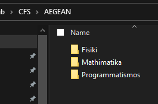
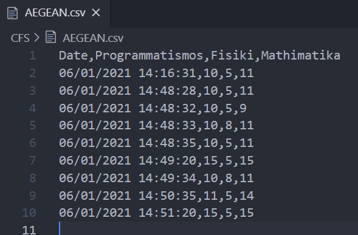
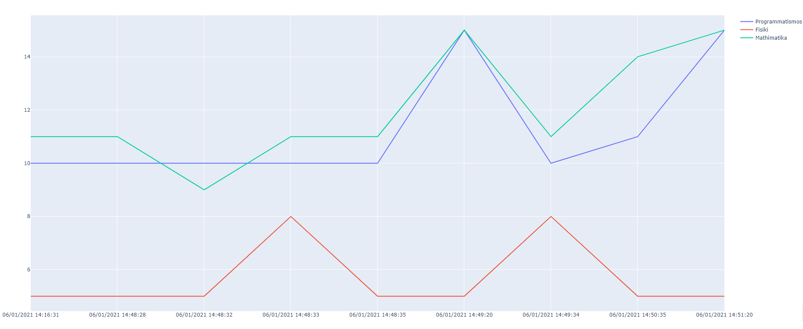

# Counter File System

This project is for learning purposes only.

CFS is a project in which the user selects a folder that he wants to graphically represent how many files each subfolder consists of. If the files are found in the subfolders, they will be saved in a CSV file.

For example in the image below I have chosen the folder of my school and I am interested to check how many files each subfolder with lessons of my school has.

The number of files of each course is always stored in a CSV file as in the image below.

Αs we see the first row of the file is the date as well as the names of the courses (subfolders). Then the program counts the number of the files. If the CSV file already exists then our program doesn't create a new file, but appends the next measurements. The measurements is done every time we run the main file.

## Todos

- [ ] Code improving
- [ ] Improving documentation
- [ ] create a GUI to plot the code
- [ ] Create a frontend/simple GUI (with Plot)
- [ ] Create a simple CLI (with input arguments)
- [ ] Select any other folder and plot it (should a new CSV files be created?)
- [ ] Create a Changelog
- [ ] Testing (any ideas?)

### Contributing

I am very happy that you consider implementing the CFS for me! Being one of our contributors, you agree and confirm that:

- You did your work - no plagiarism allowed
  - Any plagiarized work will not be merged.
- Your work will be distributed under MIT License once your pull request is merged.
- You submitted work fulfils or mostly fulfils our styles and standards.

New implementation is welcome! For example, new solutions for a problem, different representations for a graph data structure or algorithm designs with different complexity but identical implementation of an existing implementation is not allowed. Please check whether the solution is already implemented or not before submitting your pull request.

Improving comments and writing proper tests are also highly welcome.

### Contribution

We appreciate any contribution, from fixing a grammar mistake in a comment. Please read this section if you are contributing your work.
