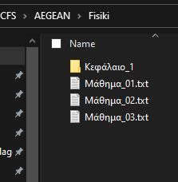
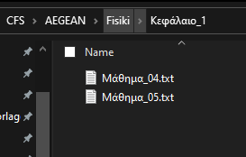

# Σύστημα Ανάλυσης Δεδομένων (CFS)

Το **CFS** παρέχει στο χρήστη πληροφορίες για το συνολικό αριθμό αρχείων των φακέλων, οι οποίοι βρίσκονται στον φάκελο που επιλέγει ο ίδιος να αναλύσει. Ο αριθμός των αρχείων κάθε υποφακέλου αποθηκεύεται κάθε φορά που τρέχει το πρόγραμμα σε ένα CSV αρχείο. Το αρχείο αυτό έχει το όνομα του φακέλου που έχει επιλέξει να αναπαραστίσει. Για παράδειγμα εάν ο χρήστης επιλέξει σαν root folder τον φάκελο της σχολής του (π.χ AEGEAN) και σε αυτον τον φάκελο υπάρχουν υποφακέλοι με τα μαθήματα της σχολής (π.χ Programmatismos, Fisiki, Mathimatika), τοτε το CFS θα μετρήσει τον συνολικό αριθμό των αρχείων του κάθε μαθήματος ξεχωριστά και θα πάει να τον αποθηκέυσει στο CSV. Για παράδειγμα στην παρακάτω φωτογραφία ο root φάκελος είναι η σχολή `AEGEAN` η οποία έχει τα εξής μαθήματα:

- Programmatismos
- Fisiki
- Mathimatika.

Επίσης οι φάκελοι με τα μαθήματα μπορεί και αυτοί να έχουν επιπλέον υποφακέλους, αλλά το CFS θα μετρήσει το συνολικό αριθμό των αρχείων συμπεριλαμβανομένου και τον αριθμό των αρχείων στους υποφακέλους.

Για παράδειγμα ο φάκελος `Fisiki` έχει έναν υποφάκελο `Κεφάλαιο_1` ο οποίος έχει και αυτος με την σειρά του 2 επιπλέον αρχεία. Οπότε το πρόγραμμα θα αποθηκεύσει στο CSV για το συγκεκριμένο μάθημα τον αριθμό 5, διότι 3 αρχεία υπάρχουν στο μάθημα της Φυσικής και 2 αρχεία στον φάκελο `Κεφάλαιο_1`.

Το CSV αρχείο όπως αναφέραμε παραπάνω, αποθηκεύει το συνολικό αριθμό των αρχείων (μαθημάτων της σχολής) για το κάθε μάθημα ξεχωριστά. Η πρώτη σειρά του αρχείου έχει την ημερομήνια που έγινε η μέτρηση των αρχείων και στη συνέχεια στις επόμενες στήλες αποθηκεύονται τα ονόματα των υποφακέλων (μαθήματα της σχολής). Έπειτα στις επόμενες σειρές γίνεται η μέτρηση των αρχείων στις οποίες συμπεριλαμβάνεται εκτός απο την ημερομηνία και η ώρα. Κάθε μέτρηση δεσμεύει μια σειρά.

Μετά την καταχώρηση των αρχείων στο CSV, το CFS είναι έτοιμο να αναπαραστήσει τα δεδομένα όπως βλέπουμε στο παρακάτω διάγραμμα.

## Todos

- [ ] Καλυτέρευση κώδικα (clean up)
  - [ ] Καλύτερα ονόματα στις μεταβλητές
- [ ] Δημιουργία documentation με sphinx
- [ ] Έλεγχος με flake σε yml αρχείο κάθε φορα που γίνεται push ή pull request
- [ ] Δημιουργία GUI με tkinter για τα παραπάνω διαγράμματα
- [ ] Δημιουργία CLI (με input arguments) για αυτοματισμό
- [ ] Να μπορεί ο χρήστης να διαλέγει κάθε φορά τον φάκελο (path dir) με τα αντίστοιχα αρχεία που επιθυμει να αναπαραστήσει.
- [ ] Δημιουργία Changelog
- [ ] Δημιουργία setup.py αρχείου
- [ ] Testing (CI)
- [ ] Backup CSV αρχείων

### Backup CSV

Στο GUI θέλουμε να υπάρχει η δυνατότητα να μπορεί ο χρήστης οποιαδήποτε στιγμή να κρατήσει σε backup το διάγραμμα (το αντίστοιχο CSV αρχείο). Το Backup είναι σημαντικό να γίνει διότι σε περίπτωση που σβηστεί ένας φάκελος (στον root folder) θα πρέπει να σβηστεί και απο το CSV η αντίστοιχη στήλη. Στη περίπτωση που δεν σβήναμε τη στήλη απο το CSV θα είχαμε μελλοντικά πρόβλημα, αν ο χρήστης μετα τη διαγραφή φακέλων δημιουργούσε καινούργιους, τότε το CFS θα αποθήκευε στο CSV στις παλιές στήλες τα καινούργια δεδομένα.

### Αλλαγή Root Path

Κάθε φορά που ο χρήστης επιλέγει να κάνει αλλαγή root path στο GUI, το CFS δημιουργεί στο φάκελο `report` ένα CSV αρχείο. Το όνομα του CSV θα πρέπει να είναι ίδιο με το όνομα του `root folder`. Κάθε φορά που ο χρήστης αλλάζει φάκελο, πρέπει να γίνεται αναζήτηση στο φάκελο `report` για τη περίπτωση που υπάρχει ήδη το αρχείο CSV. Στην περίπτωση που το CSV δεν είχε το ίδιο όνομα μετά την αλλαγή του `root folder`, θα δημιουργούνταν ένα καινούργιο αρχείο CSV με διαφορετικό όνομα.

### GUI

- [ ] Button Exit για τερματισμό του προγράμματος
- [ ] Button για Backup
- [ ] Πεδίο καταχώρησης κειμένου που θα εισάγουμε το root path
- [ ] Button το οποίο θα ανοίγει το Windows Explorer φάκελο για την επιλογή του root folder (μετα την επιλογή του φακέλου το path πρέπει να εμφανίζεται στο Entry)
- [ ] Διάγραμμα με τα δεδομένα
- [ ] Πίνακας δεδομένων (π.χ Fisiki: 5 αρχεία) σε φθίνουσα σειρά
- [ ] Εμφάνιση καταχωρήσεων στο CSV
- [ ] Μέσος όρος αρχείων για τον κάθε υποφάκελο
- [ ] Καθαρισμός δεδομένων στο CSV (default: 500 δεδομένα), εκτός εάν ο χρήστης επιλεξει σε ένα checkbox να μη γίνεται ποτέ καθαρισμός δεδομένων
- [ ]  Επίσης σε μια dropdown list έχει τη δυνατότητα να αλλάξει τη default τιμή καθαρισμού του CSV
- [ ] Δημιουργία INI (Config) αρχείου σε περίπτωση που ο χρήστης θέλει να αποθηκεύει τις ρυθμίσεις του GUI. Οπότε κάθε φορά που ξεκινάει το GUI, θα πρέπει να ελέγχουμε εαν υπάρχει το INI αρχείο! Στην περίπτωση που δεν υπάρχει το GUI εμφανίζει τις default τιμες (π.χ καθαρισμος CSV στις 500 σειρες)
- [ ] Σε περίπτωση που στην επόμενη μέτρηση παρατήρησουμε ότι κάποιοι φάκελοι διαγράφτηκαν, εμφανίζουμε στο χρήστη μήνυμα που θα τον ρωτάμε εάν επιθυμεί να κάνει Backup.

## [Contribution Guidance](https://www.atlassian.com/git)

- Create a "repository" (project) with a git hosting tool (like Bitbucket)
- Copy (or clone) the repository to your local machine
- Add a file to your local repo and "commit" (save) the changes
- "Push" your changes to your master branch
- Make a change to your file with a git hosting tool and commit
- "Pull" the changes to your local machine
- Create a "branch" (version), make a change, commit the change
- Open a "pull request" (propose changes to the master branch)
- "Merge" your branch to the master branch
